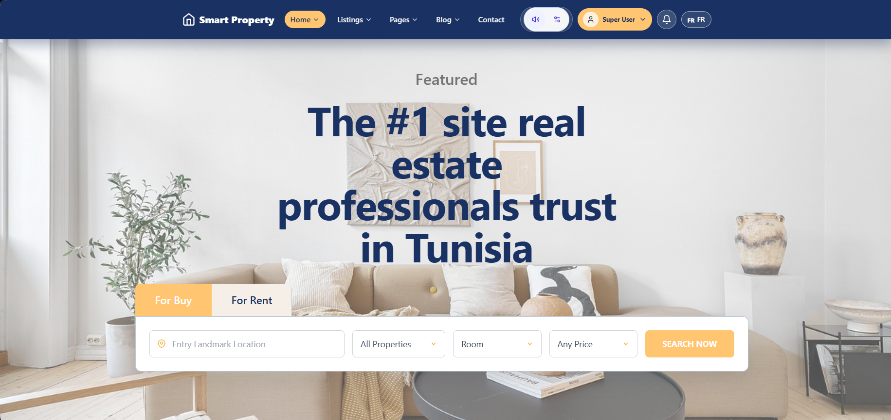
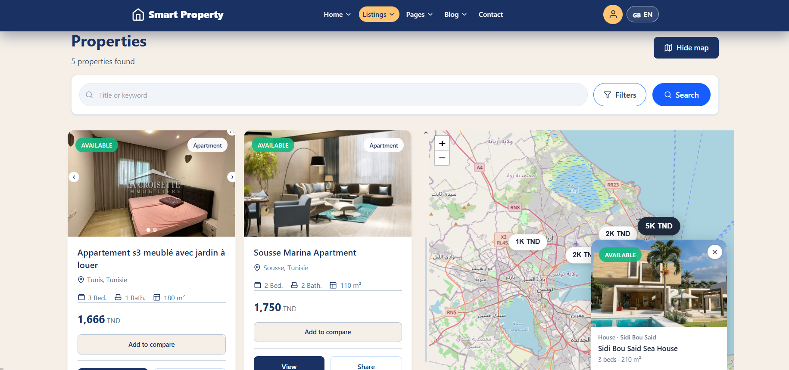
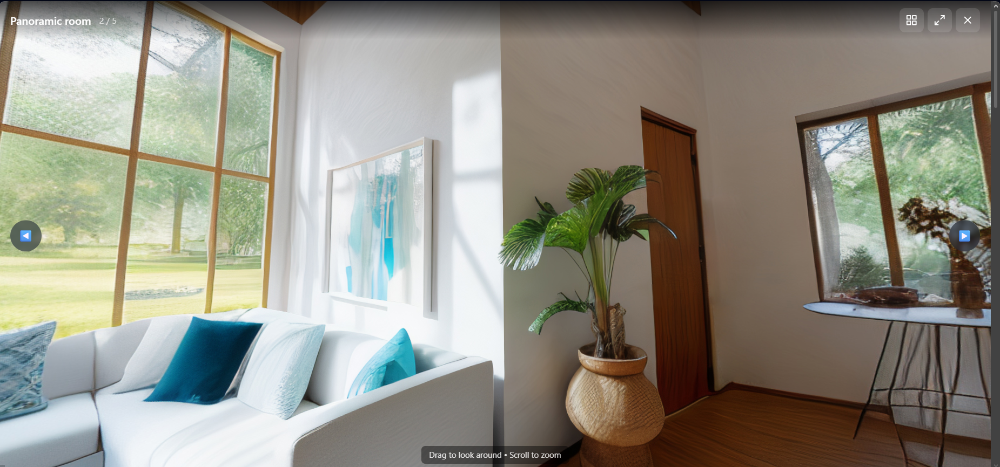
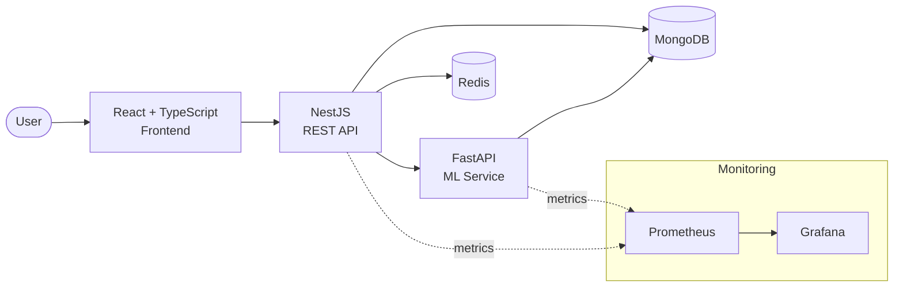
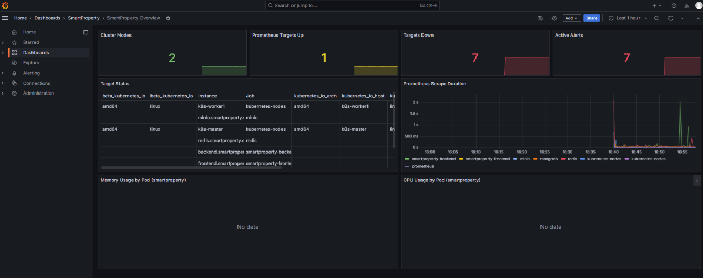
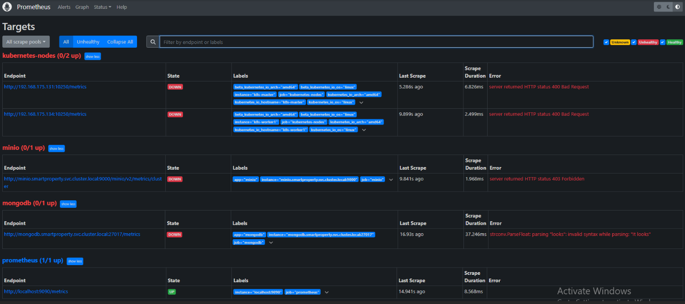

# SmartProperty

> A SaaS property-management platform that collapses the rental lifecycle — from listing to lease — into a single dashboard, with AI-driven tenant matching and rental-price prediction.


---

## Overview

**SmartProperty** is a full-stack SaaS platform built for real-estate agencies, property managers, and owners to run their portfolios from one place. It handles the day-to-day operations — listings, tenants, and property management — and layers on machine learning to take the guesswork out of two hard problems: **what to charge** and **who to rent to**.

The system is built as a set of cooperating services: a React/TypeScript frontend, a NestJS REST API, a dedicated Python/FastAPI machine-learning service, MongoDB for persistence, and Redis for caching — all containerized and shipped through a Jenkins CI/CD pipeline with quality gates and full observability.

## Screenshots

<!--
  Put your image files in a docs/screenshots/ folder in this repo, then update the
  filenames below to match. Use lowercase names with no spaces (e.g. dashboard.png).
  Add or remove rows so the grid matches the screenshots you actually have.
-->



| AI tenant matching | 3D house tour |
| :---: | :---: |
|  |  |

| Listings management | Tenant management |
| :---: | :---: |

<!-- Optional but strong: a short demo GIF of the app in action.

-->

## Key features

**Core platform**
- Centralized dashboard for managing property listings, tenants, and operations
- Full property and tenant lifecycle in one interface

**AI & machine learning**
- Tenant–property recommendation engine that matches tenants to the most relevant listings
- Rental-price prediction to support data-driven pricing
- (Served by a standalone Python/FastAPI service, decoupled from the main API)

**Security**
- JWT-based authentication
- Role-Based Access Control (RBAC) for agencies, managers, and owners
- Multi-device session management

**DevOps & observability**
- Complete CI/CD pipeline with Jenkins
- Containerized with Docker / Docker Compose
- Static analysis and quality gates via SonarQube
- Runtime monitoring with Prometheus + Grafana
- High test coverage with Jest and Vitest

## Architecture



| Service | Responsibility |
| --- | --- |
| **Frontend** | React + TypeScript UI for listings, tenants, and operations |
| **API** | NestJS REST API — business logic, auth, data access |
| **ML service** | Python + FastAPI — tenant matching & price prediction |
| **MongoDB** | Primary datastore |
| **Redis** | Caching layer for performance |
| **Prometheus / Grafana** | Metrics collection and dashboards |

## Tech stack

| Layer | Technologies |
| --- | --- |
| Frontend | React, TypeScript |
| Backend | NestJS, Node.js, REST API |
| Machine learning | Python, FastAPI |
| Data | MongoDB, Redis |
| Auth & security | JWT, RBAC, multi-device sessions |
| DevOps | Docker, Docker Compose, Jenkins, SonarQube |
| Observability | Prometheus, Grafana |
| Testing | Jest, Vitest |

## Getting started

### Prerequisites
- Docker & Docker Compose
- (For local, non-containerized dev) Node.js 18+ and Python 3.10+

### 1. Clone
```bash
git clone https://github.com/waeldaagi/<repo-name>.git
cd <repo-name>
```
<!-- TODO: replace <repo-name> with the actual repository name -->

### 2. Configure environment
Copy the example file and fill in your values:
```bash
cp .env.example .env
```

<!-- TODO: confirm these match your actual variable names, then keep this block in .env.example -->
```env
# API (NestJS)
PORT=3000
MONGODB_URI=mongodb://mongo:27017/smartproperty
JWT_SECRET=your_jwt_secret
JWT_EXPIRES_IN=1d
REDIS_HOST=redis
REDIS_PORT=6379
ML_SERVICE_URL=http://ml-service:8000

# ML service (FastAPI)
ML_PORT=8000

# Frontend
VITE_API_URL=http://localhost:3000
```

### 3. Run with Docker Compose (recommended)
```bash
docker compose up --build
```
This starts the frontend, API, ML service, MongoDB, and Redis together.

<!-- TODO: confirm the URLs/ports below match your compose file -->
- Frontend → http://localhost:5173
- API → http://localhost:3000
- ML service → http://localhost:8000

### Running services individually (local dev)
```bash
# API
cd backend && npm install && npm run start:dev

# ML service
cd ml-service && pip install -r requirements.txt && uvicorn main:app --reload

# Frontend
cd frontend && npm install && npm run dev
```
<!-- TODO: adjust folder names to match your repo structure -->

## Testing
```bash
# Backend / frontend unit & integration tests
npm run test

# Coverage
npm run test:cov
```

## CI/CD & quality
- **Jenkins** runs the build, test, and deployment pipeline on each change.
- **SonarQube** enforces static-analysis quality gates (code smells, coverage, security hotspots).
- **Docker Compose** provides reproducible builds across environments.

## Observability
- **Prometheus** scrapes metrics from the API and ML service.
- **Grafana** visualizes service health and performance.

<!--
  Add your monitoring screenshots to docs/screenshots/ and update the names below.
  A live Grafana board with real metrics is strong proof of the observability work —
  show service health, request latency/throughput, and resource usage if you have them.
-->



| Request latency & throughput | Prometheus targets |
| :---: | :---: |
|  |  |

## Roadmap
<!-- TODO: keep, edit, or delete — a short honest roadmap signals active thinking -->
- [ ] Marketing-content generation for listings
- [ ] Rental-performance forecasting
- [ ] Expanded analytics dashboard

## Author

**Wael Daagi** — Full-Stack Developer
- Portfolio: [waeldaagi.dev](https://www.waeldaagi.dev)
- LinkedIn: [daagi-wael](https://www.linkedin.com/in/daagi-wael-78499122a/)
- GitHub: [@waeldaagi](https://github.com/waeldaagi)

## License
<!-- TODO: add a license if you want one. MIT is the common, permissive choice for showcase repos. -->
