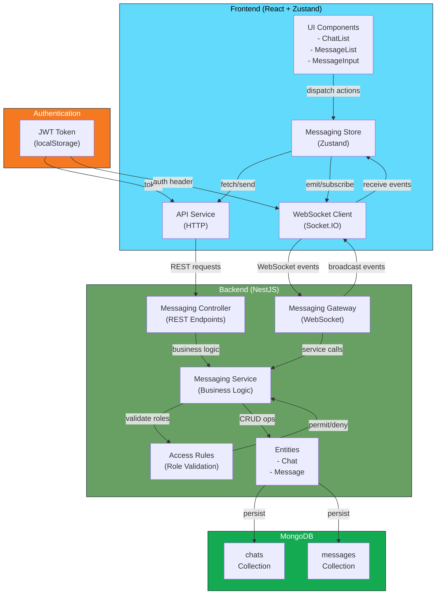
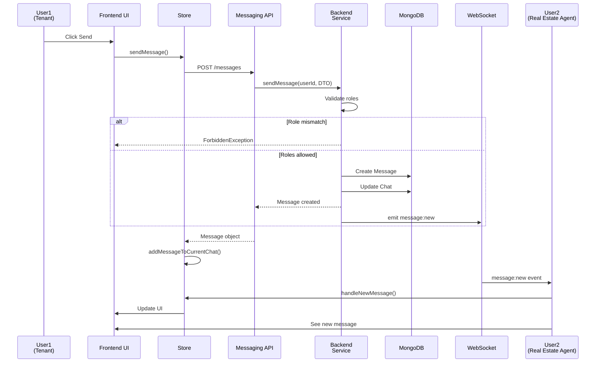
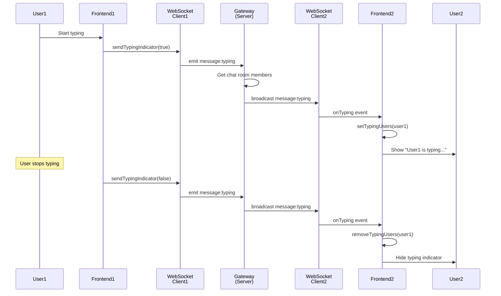
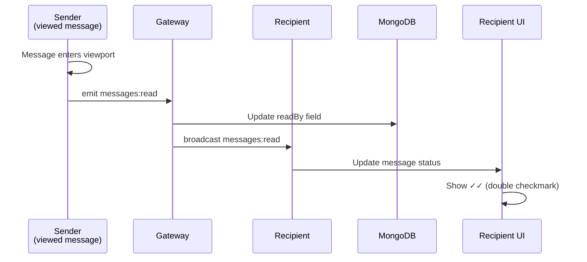
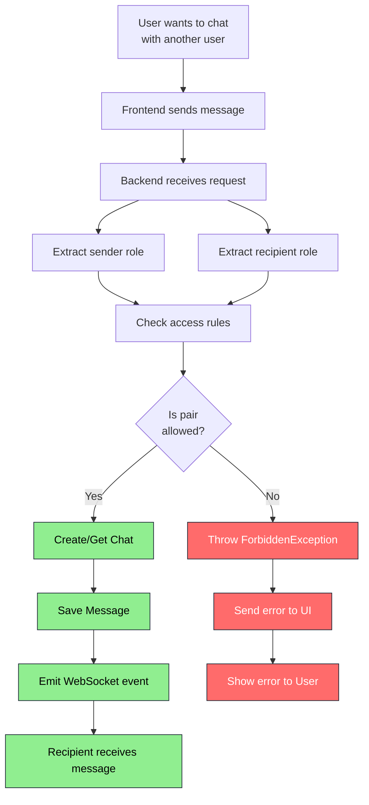
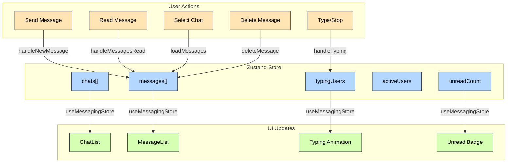
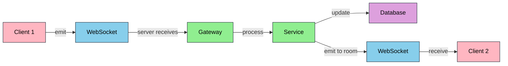
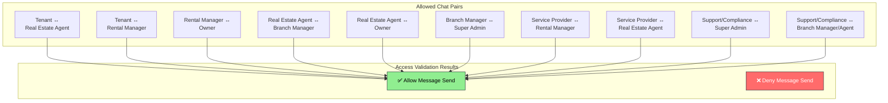

# Messaging System Architecture Diagram

## Data Flow Diagrams

### 1. Sending a Message

### 2. Real-Time Typing Indicator

### 3. Message Read Status

### 4. Role-Based Access Control

## State Management Flow

## WebSocket Event Flow

## Role-Based Access Matrix

