# Actors and Dashboards Specification

## Overview

SmartProperty is a multi-tenant SaaS platform for end-to-end property management and rental matching, designed for agencies, managers, owners, and tenants. It combines secure role-based operations (authentication, verification, permissions), operational modules (properties, uploads, applications, notifications), and AI decision support (matching, pricing, document analysis) across three applications: frontend (React 19 + Vite + TypeScript + TailwindCSS), backend (NestJS 11 + MongoDB TypeORM), and ai-services (FastAPI).

### Actor List

- **Guest (not logged in):** anonymous visitor browsing public inventory and onboarding flows.
- **Super Administrator:** global platform governance, multi-tenant controls, policy and BI ownership.
- **Branch Manager:** branch-level performance owner, pricing/conditions validation, team oversight.
- **Real Estate Agent / Manager:** listing operations, applicant handling, day-to-day field execution.
- **Rental Manager:** active rental lifecycle management, arrears follow-up, tenant operations.
- **Accountant / Administrative Assistant:** finance operations, reconciliation, invoicing, tax support.
- **Owner (Landlord):** asset owner approval authority and portfolio monitoring.
- **Tenant / Candidate Tenant:** discovery, application, verification, lease/payment self-service.
- **Service Provider:** intervention execution, evidence upload, and service invoicing.
- **AI System (technical actor):** automated valuation, matching, document analysis, recommendation generation.
- **Support / Compliance Reviewer (optional operating role):** escalations, policy checks, compliance review assistance.

## Actor Relationship Map

```mermaid
flowchart TD
  G[Guest] -->|Register / Sign in| AUTH[Auth]

  SA[Super Administrator] --> AUTH
  BM[Branch Manager] --> AUTH
  AG[Real Estate Agent / Manager] --> AUTH
  RM[Rental Manager] --> AUTH
  AC[Accountant / Admin Assistant] --> AUTH
  OW[Owner] --> AUTH
  TE[Tenant / Candidate] --> AUTH
  SP[Service Provider] --> AUTH
  CR[Support / Compliance Reviewer] --> AUTH

  TE -->|Identity + dossier docs| VER[Verification]
  OW -->|Identity + ownership docs| VER
  AG -->|Professional docs| VER
  SP -->|Vendor docs| VER
  CR -->|Case review| VER
  SA -->|Policy + override| VER

  AG -->|Create/manage listing| PROP[Properties]
  BM -->|Validate rates/conditions| PROP
  OW -->|Approve strategic actions| PROP
  TE -->|Search/view/apply| PROP

  RM -->|Create/activate/renew lease| LEASE[Leases]
  OW -->|Validate lease terms and renewals| LEASE
  TE -->|Review, sign, and track lease| LEASE

  TE -->|Application uploads| UP[Uploads]
  AG -->|Listing media uploads| UP
  OW -->|Legal docs uploads| UP
  SP -->|Intervention photos/reports| UP
  CR -->|Evidence review| UP

  PROP --> NOTIF[Notifications]
  VER --> NOTIF
  UP --> NOTIF
  LEASE --> NOTIF

  AI[AI Matching/Pricing] -->|Price range + confidence| AG
  AI -->|Decision support| BM
  AI -->|Portfolio insight| OW
  AI -->|Candidate matching| TE
  AI -->|Governance telemetry| SA

  RM -->|Lease health, arrears workflow| NOTIF
  AC -->|Finance events, invoices| NOTIF
  SP -->|Intervention assignment updates| NOTIF
```

**Diagram intent:**

- Auth and Verification are trust and access gates before privileged actions.
- Properties and Uploads are the operational backbone for listing, application, and intervention workflows.
- Notifications synchronize all actors based on role-specific events.
- AI System is advisory and explainable; final decisions remain human and role-authorized.

## Roles & Permissions Matrix

Legend: **Allowed** = full access in role scope, **Limited** = conditional/scoped access, **Not Allowed** = no direct access.

| Feature / Module                         | Guest       | Super Admin | Branch Manager | Agent / Manager | Rental Manager | Accountant / Admin | Owner       | Tenant / Candidate | Service Provider | AI System   |
| ---------------------------------------- | ----------- | ----------- | -------------- | --------------- | -------------- | ------------------ | ----------- | ------------------ | ---------------- | ----------- |
| Register / Sign in / Session management  | Limited     | Allowed     | Allowed        | Allowed         | Allowed        | Allowed            | Allowed     | Allowed            | Allowed          | Limited     |
| Profile and role settings                | Not Allowed | Allowed     | Limited        | Limited         | Limited        | Limited            | Limited     | Limited            | Limited          | Not Allowed |
| Submit verification documents            | Not Allowed | Limited     | Limited        | Allowed         | Limited        | Limited            | Allowed     | Allowed            | Allowed          | Not Allowed |
| Verification decision and override       | Not Allowed | Allowed     | Limited        | Not Allowed     | Not Allowed    | Not Allowed        | Not Allowed | Not Allowed        | Not Allowed      | Not Allowed |
| Browse and search properties             | Allowed     | Allowed     | Allowed        | Allowed         | Allowed        | Limited            | Allowed     | Allowed            | Limited          | Not Allowed |
| Create/edit listing drafts               | Not Allowed | Limited     | Limited        | Allowed         | Not Allowed    | Not Allowed        | Limited     | Not Allowed        | Not Allowed      | Not Allowed |
| Publish listing                          | Not Allowed | Allowed     | Limited        | Limited         | Not Allowed    | Not Allowed        | Limited     | Not Allowed        | Not Allowed      | Not Allowed |
| Application submission                   | Not Allowed | Limited     | Not Allowed    | Not Allowed     | Not Allowed    | Not Allowed        | Not Allowed | Allowed            | Not Allowed      | Not Allowed |
| Application review and recommendation    | Not Allowed | Limited     | Limited        | Allowed         | Allowed        | Limited            | Limited     | Not Allowed        | Not Allowed      | Allowed     |
| Final decision in high-risk cases        | Not Allowed | Allowed     | Limited        | Limited         | Limited        | Not Allowed        | Limited     | Not Allowed        | Not Allowed      | Not Allowed |
| Upload property media                    | Not Allowed | Limited     | Limited        | Allowed         | Not Allowed    | Not Allowed        | Limited     | Not Allowed        | Not Allowed      | Not Allowed |
| Upload personal/financial docs           | Not Allowed | Limited     | Not Allowed    | Not Allowed     | Not Allowed    | Limited            | Limited     | Allowed            | Not Allowed      | Not Allowed |
| Upload intervention reports/photos       | Not Allowed | Limited     | Limited        | Limited         | Limited        | Not Allowed        | Limited     | Not Allowed        | Allowed          | Not Allowed |
| Notifications configuration              | Not Allowed | Allowed     | Allowed        | Allowed         | Allowed        | Allowed            | Allowed     | Allowed            | Allowed          | Not Allowed |
| Trigger AI pricing                       | Not Allowed | Limited     | Allowed        | Allowed         | Limited        | Not Allowed        | Limited     | Not Allowed        | Not Allowed      | Allowed     |
| Trigger AI matching                      | Not Allowed | Limited     | Allowed        | Allowed         | Allowed        | Not Allowed        | Limited     | Limited            | Not Allowed      | Allowed     |
| View AI explainability/confidence        | Not Allowed | Allowed     | Allowed        | Allowed         | Allowed        | Limited            | Allowed     | Limited            | Not Allowed      | Allowed     |
| Finance exports and reconciliation       | Not Allowed | Allowed     | Limited        | Not Allowed     | Limited        | Allowed            | Limited     | Not Allowed        | Limited          | Not Allowed |
| Intervention assignment and SLA tracking | Not Allowed | Allowed     | Limited        | Limited         | Allowed        | Limited            | Limited     | Not Allowed        | Allowed          | Not Allowed |
| Multi-tenant governance and user admin   | Not Allowed | Allowed     | Limited        | Not Allowed     | Not Allowed    | Not Allowed        | Not Allowed | Not Allowed        | Not Allowed      | Not Allowed |

### Approval and Verification Gates

- **Publishing gate:** listing publication is blocked until required role verification is approved and branch/owner validation gates are satisfied.
- **Applicant gate:** candidate must complete mandatory dossier uploads before decisioning workflow can be finalized.
- **Risk gate:** high-risk recommendations from AI document/risk analysis require human review (Branch Manager and/or Super Admin).
- **Financial gate:** payout or accounting-sensitive actions require accountant/admin validation where configured.
- **Intervention gate:** service provider intervention closure requires required report/photo evidence upload.

## Dashboards by Actor

## Guest (Not Logged In)

### Primary Goals

- Discover relevant properties quickly.
- Understand trust mechanisms (verification and secure process).
- Convert to registration.

### Dashboard Layout

**Key sections**

- Public listing feed
- Search filters and map summary
- Trust and process explainer

**Suggested widgets/cards**

- Featured listings card
  : Empty: no featured properties
  : Loading: property skeleton tiles
  : Error: retry + support link
- Quick filters card (budget/location/type)
- Why verify card (tenant and owner benefits)

**CTA hierarchy (top 3 actions)**

- Create account
- Sign in
- View property details

**Navigation**

- Top nav: Home, Properties, How it works, Sign in, Create account

### Feature Access

- Browse public inventory
- Start registration/login only

### Notifications

- No operational notifications

## Super Administrator

### Primary Goals

- Govern tenants, roles, and security posture.
- Control verification policy and escalations.
- Monitor global KPIs and AI governance.

### Dashboard Layout

**Key sections**

- Global operations KPIs
- Tenant/agency management
- Verification and escalation queue
- AI governance and explainability monitoring

**Suggested widgets/cards**

- Global health card (active tenants, pending escalations)
- Verification SLA card
- AI drift and confidence card
  : Empty: no critical incidents
  : Loading: metric skeletons
  : Error: telemetry unavailable + fallback report

**CTA hierarchy (top 3 actions)**

- Resolve escalation
- Update access policy
- Review global risk/AI alerts

**Navigation**

- Left nav: Overview, Tenants, Users/Roles, Verification, Compliance, AI Governance, Settings

### Feature Access

- Full platform governance and role administration
- Override/approval for policy-gated decisions
- Global audit and compliance visibility

### Notifications

- Security anomalies
- SLA breaches
- High-risk decision escalations
- AI governance alerts

## Branch Manager

### Primary Goals

- Supervise branch portfolio performance.
- Validate listing rates and market conditions.
- Ensure operational throughput and policy compliance.

### Dashboard Layout

**Key sections**

- Branch KPI overview
- Pricing/conditions validation queue
- Team workload and conversion funnel
- Risk/compliance watchlist

**Suggested widgets/cards**

- Branch occupancy and pipeline card
- Pricing validation queue card
- Team activity board
- Compliance exceptions card

**CTA hierarchy (top 3 actions)**

- Validate pricing/conditions
- Reassign workload
- Escalate risk case

**Navigation**

- Left nav: Dashboard, Listings, Pricing Validation, Team, Applications, Alerts

### Feature Access

- Branch-scoped listing approval and pricing validation
- Branch-level applicant decision support
- Access to AI valuation/matching insights

### Notifications

- Pricing outlier alerts
- SLA threshold warnings
- Escalated risk cases

## Real Estate Agent / Manager

### Primary Goals

- Create and maintain high-quality listings.
- Manage applications and move cases to decision.
- Use AI tools to speed marketing and pricing.

### Dashboard Layout

**Key sections**

- Daily task queue
- Listing pipeline
- Applicant board
- Upload center
- AI assistant panel

**Suggested widgets/cards**

- Draft to publish pipeline card
- Application status board
- Upload quality checklist
- AI pricing and description suggestions card

**CTA hierarchy (top 3 actions)**

- Create listing
- Review applications
- Generate AI pricing/content insight

**Navigation**

- Left nav: Dashboard, Properties, Applications, Uploads, AI Insights, Notifications

### Feature Access

- Listing creation/editing and submission for approval
- Application review recommendation
- Property media upload and quality corrections
- AI-assisted pricing and marketing content triggers

### Notifications

- New applications
- Missing document blockers
- Approval results
- AI recommendation readiness

## Rental Manager

### Primary Goals

- Operate active rentals and tenant lifecycle.
- Track and reduce arrears.
- Coordinate service operations and tenant communication.

### Dashboard Layout

**Key sections**

- Active leases
- Rent collection and arrears board
- Tenant issue queue
- Intervention coordination summary

**Suggested widgets/cards**

- Lease health card
- Arrears aging card
- Upcoming renewals card
- Intervention SLA card

**CTA hierarchy (top 3 actions)**

- Follow up arrears case
- Update lease status
- Assign intervention

**Navigation**

- Left nav: Dashboard, Leases, Payments, Arrears, Interventions, Notifications

### Feature Access

- Lease/rent workflow operations
- Arrears and payment event monitoring
- Candidate-to-tenant handoff follow-up

### Notifications

- Overdue rent alerts
- Lease renewal milestones
- Intervention completion/failure events

## Accountant / Administrative Assistant

### Primary Goals

- Maintain financial consistency.
- Perform reconciliation and invoicing operations.
- Prepare tax and audit-ready exports.

### Dashboard Layout

**Key sections**

- Invoicing queue
- Reconciliation workspace
- Export and fiscal package status
- Exceptions and adjustments

**Suggested widgets/cards**

- Pending invoices card
- Reconciliation mismatch card
- Tax period checklist card
- Financial exception card

**CTA hierarchy (top 3 actions)**

- Validate invoice batch
- Resolve reconciliation mismatch
- Export reporting package

**Navigation**

- Left nav: Dashboard, Invoices, Reconciliation, Reports/Exports, Notifications

### Feature Access

- Finance operations and exports
- Limited view of property/application context for accounting relevance
- Notification and exception management

### Notifications

- Invoice validation required
- Reconciliation discrepancies
- Fiscal deadline reminders

## Owner (Landlord)

### Primary Goals

- Monitor ROI and portfolio performance.
- Validate strategic decisions on listings and applicants.
- Keep compliance documents current.

### Dashboard Layout

**Key sections**

- Portfolio KPI summary
- Approvals queue
- Applicant outcomes
- Compliance and document center

**Suggested widgets/cards**

- Revenue and occupancy trend card
- Pending approvals card
- Compliance expiry card
- Asset-level performance card

**CTA hierarchy (top 3 actions)**

- Approve/reject pending action
- Review applicant shortlists
- Update compliance documents

**Navigation**

- Left nav: Dashboard, Portfolio, Approvals, Applicants, Documents, Notifications

### Feature Access

- Asset and decision oversight
- Strategic approval of listing/pricing/application steps
- AI valuation insight consumption

### Notifications

- Decision requests
- Pricing recommendation changes
- Compliance deadlines

## Tenant / Candidate Tenant

### Primary Goals

- Find suitable properties.
- Build complete application dossier.
- Track decisions and next actions.

### Dashboard Layout

**Key sections**

- Verification status
- Recommended listings
- Applications tracker
- Document center
- Notifications

**Suggested widgets/cards**

- Verification progress card (status, last update, next steps)
- Top matches card (compatibility score + rationale)
- Application timeline card
- Missing document checklist card

**CTA hierarchy (top 3 actions)**

- Complete verification
- Apply to listing
- Upload required document

**Navigation**

- Left nav: Dashboard, Properties, Applications, Documents, Notifications, Profile

### Feature Access

- Property search and application submission
- Personal dossier upload and status tracking
- AI-based matching view (read-only recommendations)

### Notifications

- Application received/updated/decided
- Missing dossier items
- Verification status changes

## Service Provider

### Primary Goals

- Receive and execute interventions on time.
- Upload proof of work and reports.
- Submit invoices and close tasks.

### Dashboard Layout

**Key sections**

- Assigned interventions
- Schedule and SLA board
- Work evidence upload center
- Invoicing queue

**Suggested widgets/cards**

- Today interventions card
- SLA risk card
- Upload completion card
- Invoice submission status card

**CTA hierarchy (top 3 actions)**

- Start intervention
- Upload photos/report
- Submit invoice

**Navigation**

- Left nav: Dashboard, Interventions, Schedule, Uploads, Invoicing, Notifications

### Feature Access

- Assigned intervention lifecycle
- Upload intervention evidence
- Invoice submission and tracking

### Notifications

- New assignment
- Schedule change
- Rework request
- Invoice accepted/rejected

## AI System (Technical Actor)

### Primary Goals

- Produce explainable recommendation outputs.
- Improve matching, valuation, and document analysis quality.
- Feed human workflows without replacing approval authority.

### Dashboard Layout

**Key sections**

- Model run status
- Confidence and explainability metrics
- Drift/performance monitoring
- Queue throughput and latency

**Suggested widgets/cards**

- Matching model quality card
- Pricing error band card
- OCR/document analysis confidence card
- Drift alert card

**CTA hierarchy (top 3 actions)**

- Recompute recommendation batch
- Flag low-confidence output
- Publish model-quality report

**Navigation**

- Service/internal monitoring views (operations-only, not end-user UI)

### Feature Access

- Inference and scoring services
- Explainability metadata generation
- Telemetry output to governance dashboards

### Notifications

- Processing failures
- Drift and confidence threshold breaches
- Queue saturation alerts

## Support / Compliance Reviewer (Optional)

### Primary Goals

- Review contested or sensitive cases.
- Validate compliance evidence quality.
- Escalate policy exceptions.

### Dashboard Layout

**Key sections**

- Case queue
- Verification review board
- Audit timeline
- Escalation status

**Suggested widgets/cards**

- Assigned cases card
- Evidence completeness card
- Escalation turnaround card

**CTA hierarchy (top 3 actions)**

- Open case review
- Request additional evidence
- Escalate to super admin

**Navigation**

- Left nav: Cases, Verification Reviews, Escalations, Audit Trail, Notifications

### Feature Access

- Scoped review permissions with audit logging
- Read-only cross-module context where policy allows

### Notifications

- New case assignment
- SLA reminders
- Escalation outcomes

## Core Workflows

### 1) Signup -> Verification -> First Successful Action

#### Tenant / Candidate

1. Register and authenticate.
2. Complete identity and dossier verification upload.
3. Receive verification result.
4. First successful action: submit first complete application.

#### Owner

1. Register and authenticate as owner profile.
2. Upload ownership and identity documents.
3. Compliance review completes.
4. First successful action: approve a pending listing/pricing decision.

#### Real Estate Agent / Manager

1. Register/authenticate with assigned agency role.
2. Complete professional verification.
3. First successful action: create listing draft and submit for validation.

#### Service Provider

1. Register/authenticate with vendor profile.
2. Upload compliance/vendor documents.
3. First successful action: accept intervention and upload completion evidence.

### 2) Property Creation and Publishing

1. Agent creates listing via multi-step form.
2. Agent uploads media and required property documentation.
3. AI pricing and AI description suggestions are generated (optional but recommended).
4. Branch Manager validates rate/conditions.
5. Owner validates strategic/business decision.
6. Super Admin intervention occurs only for policy exceptions.
7. Listing is published; notifications are sent to relevant actors.

### 3) Candidate Applies -> Review -> Decision -> Notification

1. Candidate selects property and starts application.
2. Candidate uploads required financial/identity dossier.
3. AI document/risk analysis generates support signals.
4. Agent and/or Rental Manager reviews file completeness and context.
5. Branch Manager validates high-impact conditions if needed.
6. Owner confirms decision where owner-approval policy applies.
7. Super Admin resolves policy-gated edge cases.
8. Candidate receives decision and next-step notification.

### 4) Upload Flow (Documents/Images) and Dashboard Placement

1. Actor initiates upload from module dashboard:
   - Candidate: Documents
   - Agent: Listing media uploads
   - Owner: Compliance documents
   - Service Provider: Intervention evidence
2. Upload validates format and size.
3. Progress and status are shown in role dashboard widget.
4. Review state updates appear: pending, accepted, rejected, needs correction.
5. Related workflows are unlocked/blocked based on upload status.

### 5) AI-Assisted Matching/Pricing Touchpoints

1. Agent triggers pricing and marketing assistance during listing setup.
2. Candidate receives ranked property matches with compatibility rationale.
3. Agent/Rental Manager sees recommendation support during application review.
4. Branch Manager and Owner consume confidence bands for pricing/decision validation.
5. Super Admin monitors model governance, drift, and threshold breaches.

### 6) Lease Handoff and Lifecycle

1. Rental Manager creates a lease from an approved application and prepares the lease template.
2. Owner validates the lease terms and renewal conditions.
3. Tenant reviews the lease, uploads any missing supporting documents, and signs digitally.
4. Owner or Rental Manager countersigns and activates the lease.
5. Move-in inventory is recorded with photos; notifications are sent to tenant, owner, and manager.
6. Before expiry, renewal reminders are issued and the Owner decides whether to renew, revise, or terminate.
7. On move-out, the final inventory and security deposit handling are recorded before the lease is closed.

## Open Questions / Assumptions

### Assumptions

- SmartProperty is operated with strict role-based access in a multi-tenant context.
- Verification is mandatory before trust-critical operations.
- AI outputs are advisory and require human authorization for final business actions.
- Approval chains may vary by agency policy, but audit logging is mandatory.
- Service Provider access is scoped only to assigned interventions and related evidence.

### Questions for Product/Business

- Which exact decisions require Owner approval vs Branch Manager-only approval?
- Is Rental Manager always a distinct role, or can Agent and Rental Manager be merged per tenant?
- What is the minimum mandatory dossier to unlock final candidate decision?
- Should candidates see AI risk/explainability fields directly, partially, or not at all?
- How should cross-agency marketplace permissions be represented in role scopes?
- Are Support and Compliance one combined role or two independent queues with separate SLAs?
